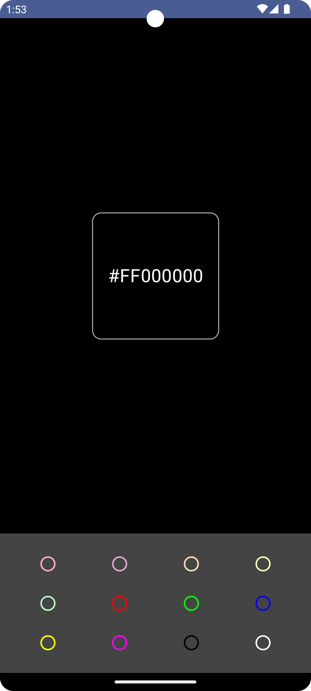
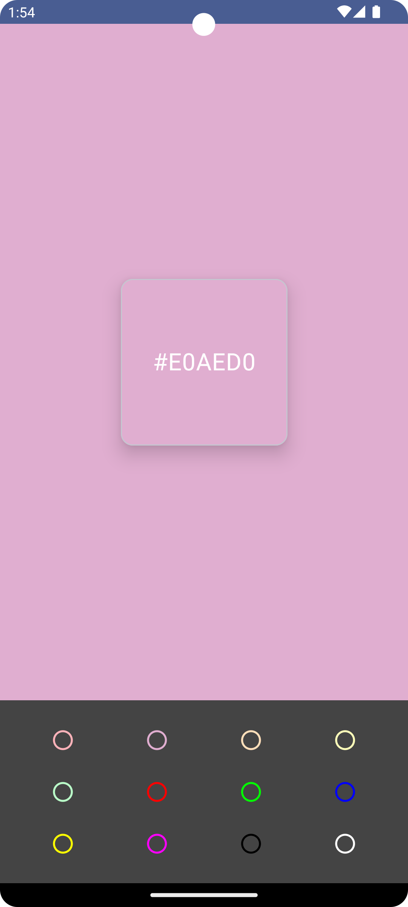

# ColorPicker App

The ColorPicker app allows users to pick and display colors from a predefined set. This application demonstrates the use of Jetpack Compose for UI development along with Android's `ViewModel` for managing UI-related data.

## Overview
The ColorPicker app provides a simple interface where users can select colors from a grid and view the selected color in a card. The app uses Jetpack Compose for the UI and Android's `ViewModel` to manage the color selection state across configuration changes like screen rotations.

## Features
- Select colors from a predefined grid.
- Display the selected color in a card.
- Persist the selected color state across configuration changes using `ViewModel`.

## Architecture
The app follows the MVVM (Model-View-ViewModel) architecture pattern:
- **Model**: Contains the data for the app (e.g., color values).
- **View**: The UI layer built with Jetpack Compose.
- **ViewModel**: Manages the UI-related data and survives configuration changes.

## Usage
The `ViewModel` in this app (`ColorPickerViewModel`) manages the state of the selected color. Here's a breakdown of how it works:

### ColorPickerViewModel
```kotlin
class ColorPickerViewModel : ViewModel() {
    private val _selectedColor = MutableLiveData<String>("#FFFFFF")
    val selectedColor: LiveData<String> get() = _selectedColor

    fun setSelectedColor(color: String) {
        _selectedColor.value = color
    }
}
```
- **_selectedColor**: A private `MutableLiveData` that holds the currently selected color.
- **selectedColor**: A public `LiveData` to expose the selected color to the UI.
- **setSelectedColor**: A function to update the selected color.

### MainActivity
```kotlin
class MainActivity : ComponentActivity() {
    private val viewModel by viewModels<ColorPickerViewModel>()
    override fun onCreate(savedInstanceState: Bundle?) {
        super.onCreate(savedInstanceState)
        setContent {
            ColorPickerTheme {
                ColorPickerApp(viewModel)
            }
        }
    }
}
```
- **viewModel**: An instance of `ColorPickerViewModel` scoped to the `MainActivity`.
- **setContent**: Sets the content view using Jetpack Compose.

### ColorPickerApp
```kotlin
@Composable
fun ColorPickerApp(viewModel: ColorPickerViewModel) {
    val selectedColor by viewModel.selectedColor.observeAsState()
    // UI code that uses selectedColor
}
```
- Observes the `selectedColor` from the `ViewModel` and updates the UI accordingly.

## Preview

  
